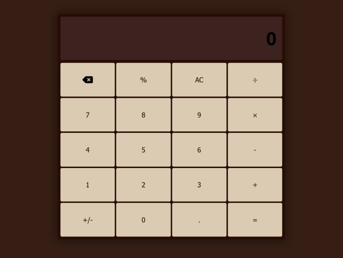

# Calculator

## Table of contents

- [Overview](#overview)
  - [Screenshot](#screenshot)
  - [Links](#links)
- [Style Guide](#style-guide)
  - [Colors](#colors)
- [My process](#my-process)
  - [Built with](#built-with)
- [Author](#author)

## Overview 

  Just a simple calculator made with JavaScript.

### Screenshot

### Links

- Live Site URL: [Calculator](https://gabrielojorge.github.io/calculator/).

## Style Guide

### Colors

- dark-brown: #270D04;
- brown: #361E14;
- light-brown: #3C231F;
- dark-beige: #CBB595;
- beige: #DACBB2;

### Typography

### Body

- Family: [Open Sans](https://fonts.google.com/specimen/Open+Sans);
- Weights: 700.

## My Process

### Built with

- HTML5;
- CSS;
- JavaScript;
- Flexbox;
- Grid;
- Mobile-first workflow.

## Author

- Website - [Gabriel O. Jorge](https://gabrielojorge.github.io/Portifolio/).